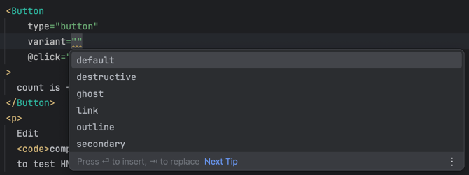

# Setup showcasing the Vue port of Shadcn

## [Shadcn-Vue](https://www.shadcn-vue.com)

### Shadcn-Vue notable links
* [introduction](https://www.shadcn-vue.com/docs/introduction.html)
* [quick install guide](https://www.shadcn-vue.com/docs/installation.html)
* [components.json config](https://www.shadcn-vue.com/docs/components-json.html)
* [themeing](https://www.shadcn-vue.com/docs/theming.html)

Shadcn approach embeds components directly into the project 
instead of being installed through a vendor package. 
This means full control of the components is left up to the dev, additionally, 
It also comes with support for TypeScript making it easy to know what properties and values a component has.

